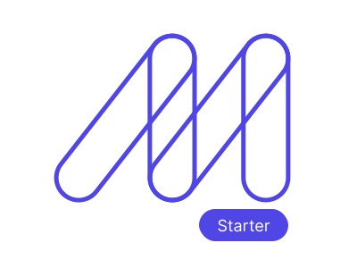

<div align="center">
  <p>
    <a href="https://maizzle.com/#gh-light-mode-only" target="_blank">
      
    </a>
    <a href="https://maizzle.com/#gh-dark-mode-only" target="_blank">
      
    </a>
  </p>
  <p>RSS Feed to Email Newsletter</p>
</div>

## About

This is the repository for the ["How to create an email newsletter from an RSS feed"](https://maizzle.com/guides/rss-feed) Maizzle guide.

## Getting Started

Install the Maizzle CLI:

```sh
npm install -g @maizzle/cli
```

Scaffold a new project with this starter:

```sh
maizzle new rss
```

Alternatively, you may clone this starter directly:

```bash
# remember to install dependencies with `npm install`
npx degit maizzle/starter-rss
```

## Development

Start a local development server:

```
npm run dev
```

Build for production:

```
npm run build
```

Maizzle documentation is available at https://maizzle.com
